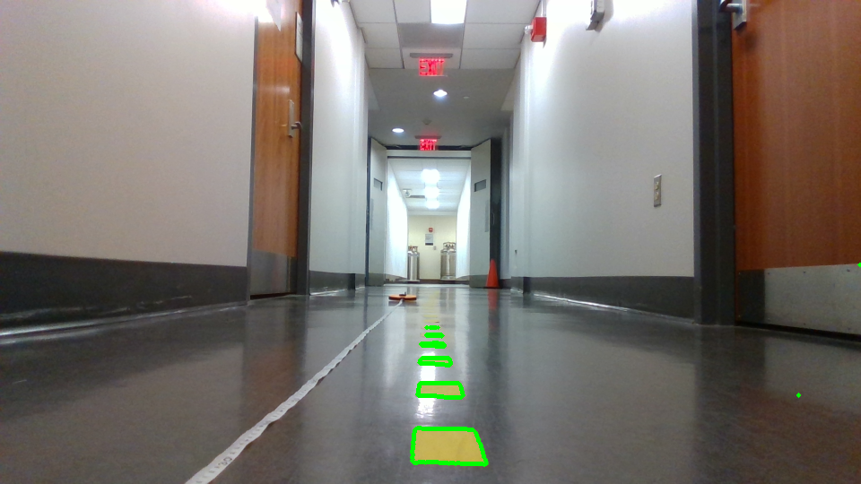
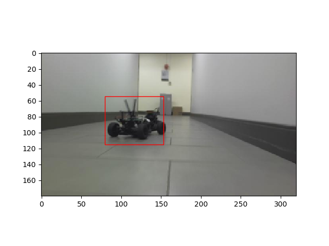
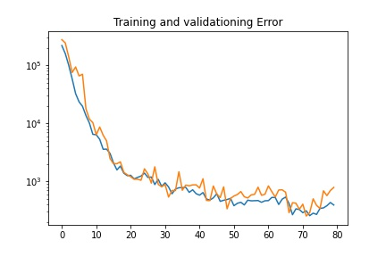

# Lab 8: Vision Lab

## The x, y distance of the unknown cones?
X = 61.75cm, Y = 13.39cm

## Lane Detection Result Image

## Integrated Object Detection + Distance Calculation Result Image

X = 1.115m, Y = -0.16m

## Neural Network Training & Testing Loss Plot

## Is FP16 faster? Why?
Yes. Time needed for inferring one image:

FP16: 0.000232s

FP32: 0.000994s

FP16 is faster because it uses 16-bit floating point instead of 32-bit, which means it reduces the precision by half. Therefore, it needs much less memory and is a lot faster.
